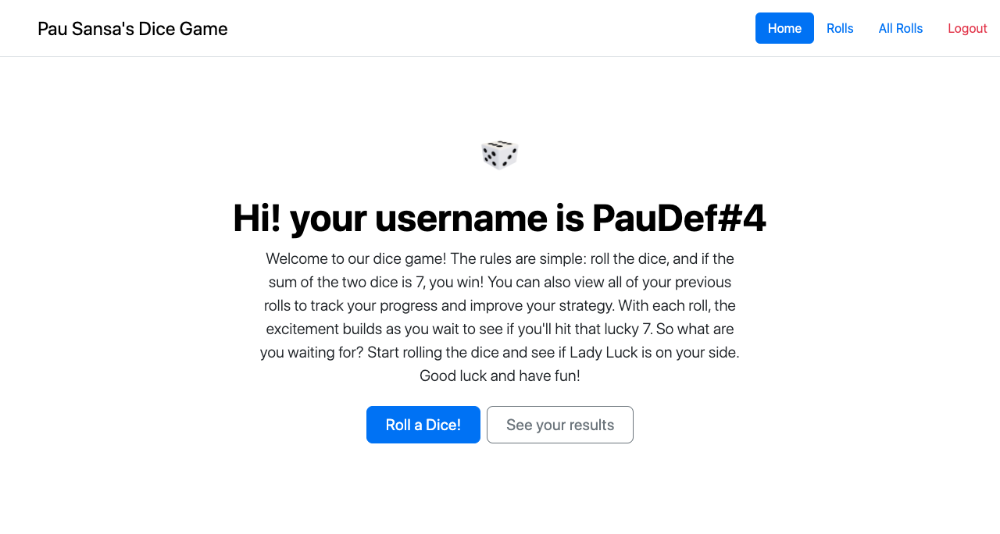

<br/>
<p align="center">
  <a href="https://github.com/PauSansa/Dicegame">
    
  </a>

<h3 align="center">Pau Sansa's Dice Game</h3>

  <p align="center">
    An innovative dice game
    <br/>
    <br/>
    <a href="https://github.com/PauSansa/Dicegame/issues">Report Bug</a>
    .
    <a href="https://github.com/PauSansa/Dicegame/issues">Request Feature</a>
  </p>
</p>

 [](https://www.codefactor.io/repository/github/pausansa/dicegame)  

## Table Of Contents

* [About the Project](#about-the-project)
* [Built With](#built-with)
* [Getting Started](#getting-started)
    * [Prerequisites](#prerequisites)
    * [Installation](#installation)
* [Usage](#usage)
* [Roadmap](#roadmap)
* [Contributing](#contributing)
* [License](#license)
* [Authors](#authors)

## About The Project



Dice games are always boring, in order to change this, we have created the most fast-pacing, exiting and hectic game ever made.

The complex structure of the game stands on throw to dice, and if the sum of these are 7, you win.

The project has frontend and backend

## Built With

<ul>
  <li><a href="https://spring.io/projects/spring-boot">Spring Boot</a> - Java-based framework for building the backend of the application.</li>
  <li><a href="https://www.thymeleaf.org/">Thymeleaf</a> - Server-side Java template engine used for rendering the frontend.</li>
  <li><a href="https://jwt.io/">JWT</a> - JSON Web Tokens for securing the application.</li>
  <li><a href="https://getbootstrap.com/">Bootstrap</a> - Frontend framework for creating responsive and mobile-first web pages.</li>
  <li><a href="https://www.mysql.com/">MySQL</a> - Relational database used for persisting user data.</li>
</ul>


## Getting Started

Simply download the project and follow the instructions below

### Prerequisites

You must have installed the JDK17

### Installation

1. Clone the repo

```sh
git clone https://github.com/PauSansa/DiceGame.git
```

2. Create a Schema in your mySQL server named "dicegame"


3. Configure your mysql in the `application.yml` file

```yml
  datasource:
    url: {your db url}
    username: {your username}
    password: {your password}
```

## Usage

Open the project in your IDE and run the main class.

Then the server will be accessible in the default port *localhost:8080*

### API

-   **Delete all rolls**

    `DELETE /api/v1/game/rolls`

    Deletes all rolls for the authenticated user.

-   **Create a new roll**

    `POST /api/v1/game/roll`

    Creates a new roll for the authenticated user and returns the roll details.

-   **Get the last ten rolls**

    `GET /api/v1/game/roll`

    Retrieves the last ten rolls for the authenticated user.


### Frontend

-   **Home page**

    `GET /`

    Displays the home page with the authenticated user's username.

-   **Roll a dice**

    `GET /roll`

    Performs a new roll and displays the results.

-   **View all rolls**

    `GET /allrolls`

    Displays all rolls made by the authenticated user.

-   **Login page**

    `GET /login`

    Displays the login page.

-   **Registration page**

    `GET /register`

    Displays the registration page.


## Roadmap

See the [open issues](https://github.com/PauSansa/Dicegame/issues) for a list of proposed features (and known issues).

## Contributing

Contributions are what make the open source community such an amazing place to be learn, inspire, and create. Any contributions you make are **greatly appreciated**.
* If you have suggestions for adding or removing projects, feel free to [open an issue](https://github.com/PauSansa/Dicegame/issues/new) to discuss it, or directly create a pull request after you edit the *README.md* file with necessary changes.
* Please make sure you check your spelling and grammar.
* Create individual PR for each suggestion.
* Please also read through the [Code Of Conduct](https://github.com/PauSansa/Dicegame/blob/main/CODE_OF_CONDUCT.md) before posting your first idea as well.

### Creating A Pull Request

1. Fork the Project
2. Create your Feature Branch (`git checkout -b feature/AmazingFeature`)
3. Commit your Changes (`git commit -m 'Add some AmazingFeature'`)
4. Push to the Branch (`git push origin feature/AmazingFeature`)
5. Open a Pull Request

## License

Distributed under the MIT License. See [LICENSE](https://github.com/PauSansa/Dicegame/blob/main/LICENSE.md) for more information.

## Authors

* **Pau Sansa** - *Backend Developer* - [Pau Sansa](https://github.com/PauSansa)
